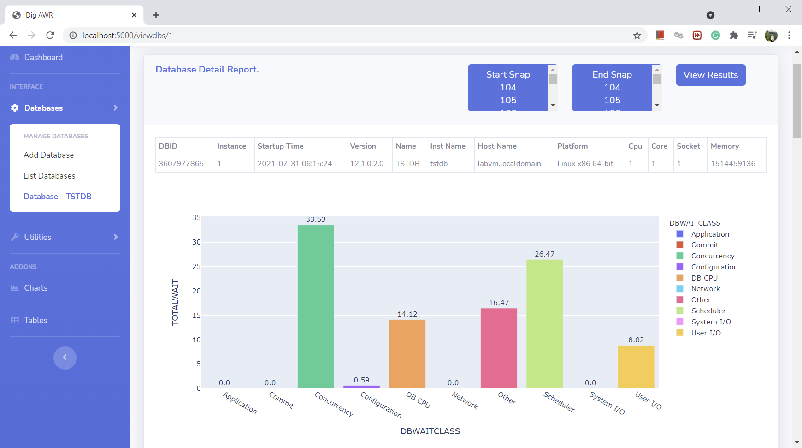
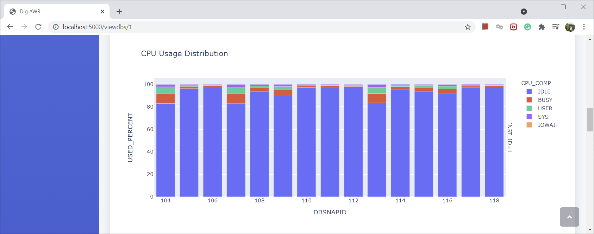
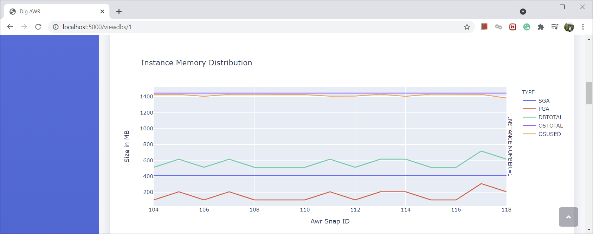
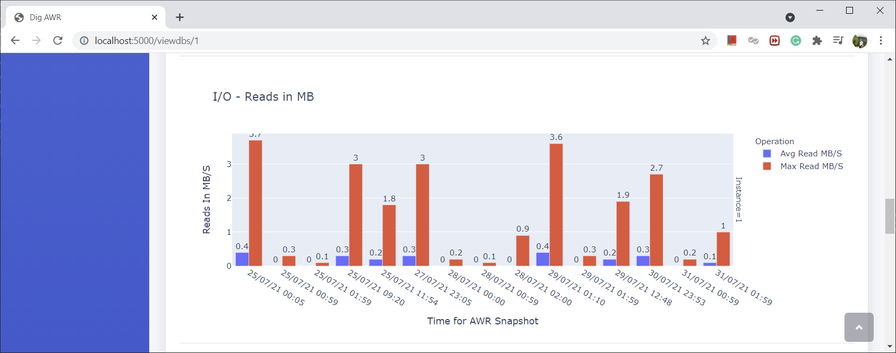
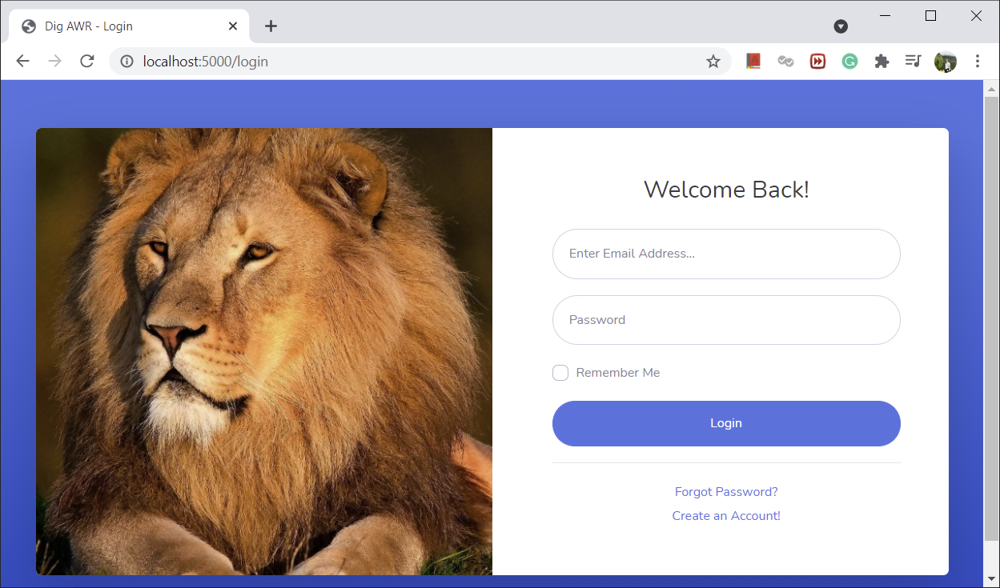
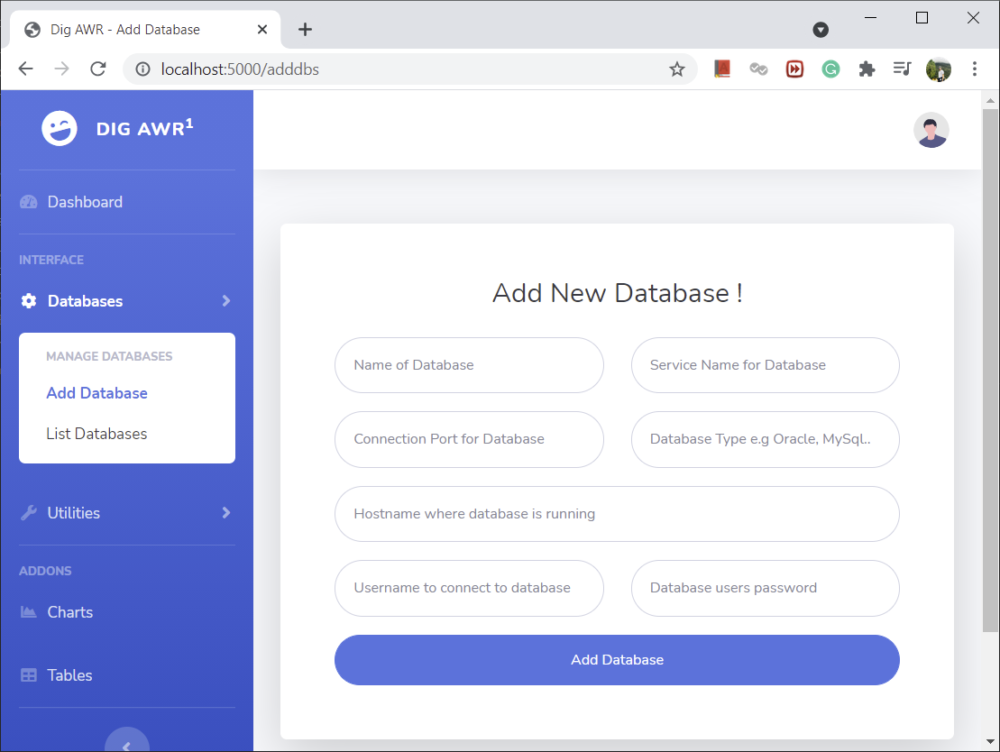

# Database Dashboard

## Monitor And Visualize Oracle Historical Performance

### DB over all waits

### DB Server CPU info

### DB Server and DB Memory Usage

### DB IO Usage

## Login Page

## Register Database
